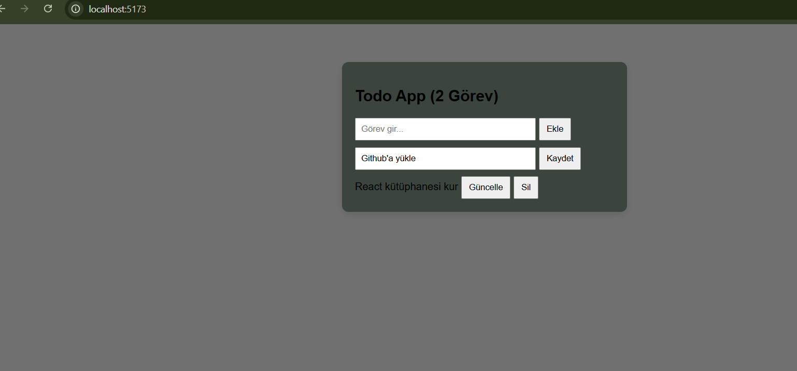

#  React Todo App

Bu proje,Web Geliştirme:Javascript dersi için hazırlanmış bitirme projesidir. JavaScript kütüphaneleri kullanılarak geliştirilmiş bir **Todo (Yapılacaklar Listesi) uygulamasıdır**.
Uygulama kullanıcıların görev eklemesine, listelemesine, güncellemesine ve silmesine olanak sağlar.

##  Kullanılan Teknolojiler

* React
* Vite
* JavaScript
* CSS
* HTML
* Netlify (Deployment)
* GitHub (Versiyon kontrolü)

##  Proje Özellikleri

* ✔️ Yeni görev ekleme
* 📋 Görevleri listeleme
* ✏️ Görev güncelleme
* ❌ Görev silme


##  Canlı Proje

Uygulamayı canlı olarak buradan inceleyebilirsiniz:

Netlify Linki:
https://69996de309f37a0008f33e3c--deft-entremet-ddf163.netlify.app/

##  Proje Görseli



##  Kurulum

Projeyi kendi bilgisayarınızda çalıştırmak için:

```bash
git clone https://github.com/elifcura/todo-app.git
cd todo-app
npm install
npm run dev
```

##  Proje Yapısı

```
todo-app
│
├── src
│   ├── components
│   ├── App.jsx
│   └── main.jsx
│
├── public
├── index.html
└── package.json
```

##  Geliştirici

Elif Cura
Frontend Developer Adayı

GitHub: https://github.com/elifcura
LinkedIn: https://www.linkedin.com/in/elif-cura-8988b83a8
